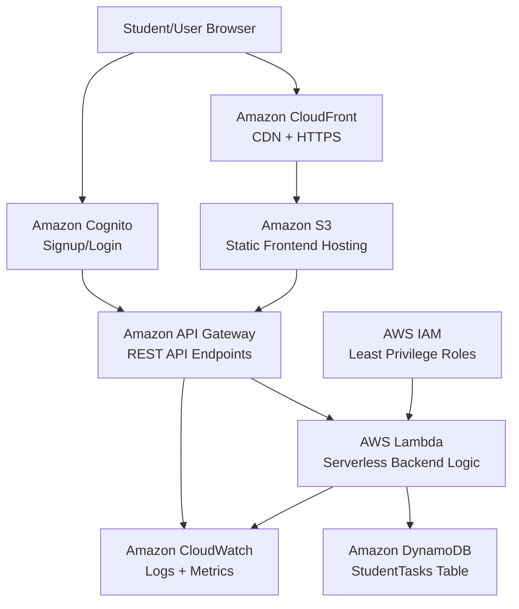

# System Architecture

## Project Title

Cloud-Based Serverless Student Task Management System

## Architecture Diagram

## Explanation

The user accesses the web application through a browser. The frontend files are hosted in Amazon S3 and delivered globally through Amazon CloudFront. When the user performs an operation such as adding, viewing, updating, or deleting a task, the frontend sends a request to Amazon API Gateway.

API Gateway forwards the request to AWS Lambda. Lambda contains the backend logic and performs CRUD operations on Amazon DynamoDB. DynamoDB stores task details using `userId` as the partition key and `taskId` as the sort key.

Amazon Cognito is used for user authentication. IAM roles are used to grant Lambda only the permissions required to access the DynamoDB table. CloudWatch records logs and metrics from Lambda and API Gateway, which helps with debugging and monitoring.

## Why This Architecture Scores Well

- It is fully serverless.
- It uses multiple AWS services from the requirement list.
- It separates frontend, API, backend logic, database, authentication, security, and monitoring.
- It is scalable because Lambda and DynamoDB handle variable traffic automatically.
- It is cost-efficient because serverless services charge mostly based on usage.
- It is secure because IAM and Cognito are included.

